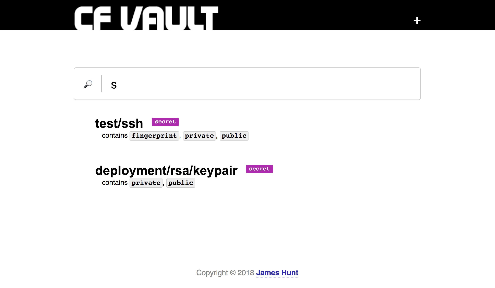
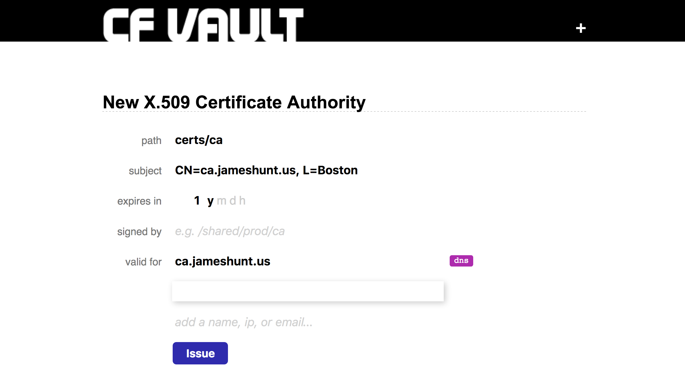

Vault UI
========

Vault UI is a small web UX for Vault, deployable to a Cloud
Foundry near you, that uses the [Vault-Broker][1].  It was part of
my talk, _The Vault Of Secrets_, presented at Cloud Foundry North
America Summit, 2018, in Boston, MA.  Slides are available
[online][2].

It supports search:

Has a variety of custom web-ish forms for entering specific types of secrets (SSH/RSA keys, X.509 CAs/certificates, etc.):

[1]: https://github.com/cloudfoundry-community/vault-broker
[2]: https://github.com/jhunt/slides/tree/master/vault
